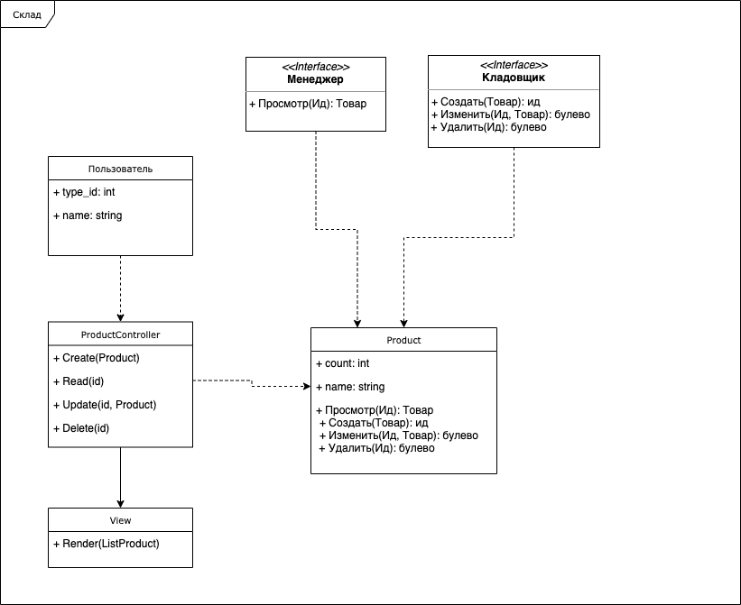

# Проектирование прикладных приложений

## Учёт товаров на складе

### Связанные сущности

1) Склад
2) Товар
3) Кладовщик
4) Менеджер по закупкам

### Связи между сущностями

1) Кладовщик - Склад = принятие и отгрузка товара на складе
2) Товар - Склад = товар находиться на складе
3) Склад - Менеджер = просмотр (и заказывать) товара 

### Функционал приложения
 
1) Кладовщик может создавать, изменять и удалять товар на складе 
2) Менеджер может просматривать товары на складе

Предметная область текущей задачи является: Товары на складе

Менеджер посмотрел на товары которые заканчиваются на складе, и заказал
Кладовщик принимает и отгружает товар на складе

Для учета товаров на складе необходимо создать таблицы:
1) Товары
2) Пользователи
3) Типы пользователей

Так как приложение будет запускаться только на двух компьютерах(кладовщик и менеджер) но с одной базой данных,
то вид приложения предполагаю клиент серверное десктопные приложение на базе паттерна MVC

